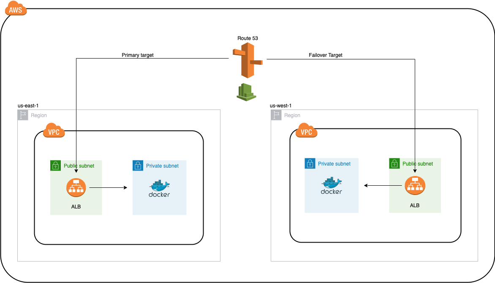
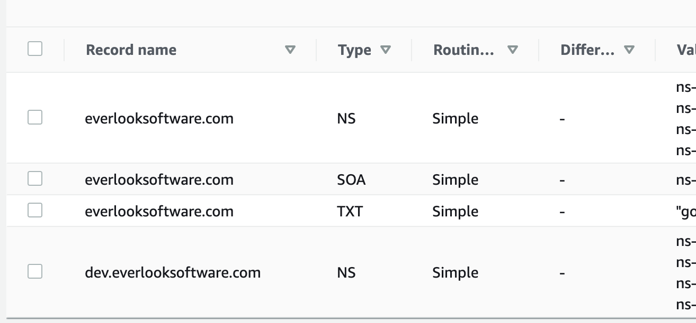

# Active-passive failover

Active-passive failover is a failover configuration where one group of resources is the `primary` target for traffic, while a `secondary` group of resources is on standby in case of failure in the primary.

The reason this is so powerful is that it helps guaruntees general availability for a system.

## Architecture overview



A few things are happening here.

1. Route 53 routes requests from our domain (dev.everlooksoftware.com) to our ALB in our primary region (us-east-1).
2. If requests fail, Route 53 directs traffic to our ALB in our secondary region (us-west-1).
3. Our ECS service (NodeJS API running on Docker) sits protected behind 2 private subnets in 2 separate AZ's.
   - This API is only exposed via our ALB which lives in two public subnets in 2 separate AZ's.
   - Each service has internet access via Nat Gateway configuration (which has public subnet access).

## Active-passive failover

We'll be using Route 53 DNS records to point our domain name to an application load balancer within our primary region (`us-east-1`).

With the help of A records, Route 53 will automatically know when an IP becomes unavailable and automatically swap to our secondary region (`us-west-1`).

_It's traditionally best practice to host resources in different regions. If you have an AZ failover strategy and the entire region goes down, your SOL._

## About the code

This project uses [Terraform](https://www.terraform.io/) for our infrastructre-as-code.

This setup also assumes that you have a multi-account AWS setup. Ideally separate accounts for dev, staging and production (as well as an 'ops' or 'management' account for anything shared).

There are challenges with this approach, but this is the most scalable way of managing infrastructure in the long run. I won't waste your time explaining why right now.

### Structure

In the `terraform` directory, you'll see `dev` and `modules` folders.

I've split out the Route 53 related code into it's own directory, and the rest of the networking / ECS-related code into another.

I could have split networking / ECS up even further, but this was sufficient for this example.

### Deploying

```bash
terraform -chdir=./terraform/dev apply
```

### Deploying to new regions

Currently this setup deploys to `us-east-1` and `us-west-1`. If you'd like to add more, just simply add another one of these blocks within the environment files.

```terraform
module "cluster-us-west-1" {
  source             = "../modules/service"
  region             = "us-west-1"
  availability_zones = ["us-west-1b", "us-west-1c"]
}
```

### Deploying to higher environments

Right now there's only a dev environment, but you can simply copy the file from dev and create `staging` or `prod` environments.

All you have to do is replace the subdomain within the `dns` module like below:

```
subdomain          = "dev"
```

As well as the subdomain within our Route 53 hosted zone.

```
resource "aws_route53_zone" "primary" {
  name = "dev.everlooksoftware.com"
}
```

_(Switch out my domain with yours)_

### Adding NS records to management account

In this example, I have each environment managing the subdomains of the application. This allows for each 'team' to deploy their own respective resources while isolating our actual domain to our management account.

1. dev -> `dev.everlooksoftware.com`,
2. staging -> `staging.everlooksoftware.com`,
3. prod -> `app.everlooksoftware.com`

Above are examples of how this can be managed.

Once the Route 53 alias records are created in each environment, you'll have to take the nameservers from each lower level account and create an NS record in the management account under your domain.

Here's what it will look like:



You should have one NS record in the managmement account per subdomain.
